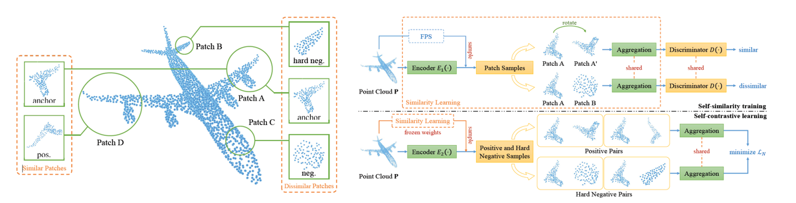

# SCL：Self-Contrastive Learning with Hard Negative Sampling for Self-supervised Point Cloud Learning


[[Paper]](https://arxiv.org/abs/2107.01886) [[Code]](https://github.com/pkudba/SCL) 

This repository is the official PyTorch implementation of the following paper: (**still under construction**)

Bi’an Du, Xiang Gao, Wei Hu, Xin Li, "Self-Contrastive Learning with Hard Negative Sampling for Self-supervised Point Cloud Learning," accepted to *ACM International Conference on Multimedia (ACM MM), July, 2021.*

## Requirements

#### Recommended Environment

The code has been tested with the following environment:

- Python3==3.8.11
- pytorch==1.7.1
- scikit-learn==0.23.2
- torch-geometric==1.6.1
- pytorch3d==0.5.0
- h5py==2.10.0

#### Install via Conda

We provide a yaml file that allows instantaneous environment setup. Run the following command and it will create a conda environment named `SCL` with all required packages installed:

```powershell
conda env create -f environment.yml
conda activate SCL
```

#### Install Manually

You may also set up the environment manually. We provide the instruction as follows:

```python
# Create a conda environment
conda create --name SCL python=3.8
conda activate SCL
# install required packages
conda install -c pytorch pytorch=1.7.1 torchvision cudatoolkit=10.2
conda install -c fvcore -c iopath -c conda-forge fvcore iopath
conda install -c bottler nvidiacub
conda install pytorch3d -c pytorch3d
conda install -y scikit-learn=0.23.2
conda install -y -c conda-forge h5py=2.10.0 
conda install -c conda-forge tensorboardx
# Install PyTorch Geometric
pip install torch-cluster==1.5.8 -f https://pytorch-geometric.com/whl/torch-1.7.1+cu102.html
pip install torch-sparse==0.6.8 -f https://pytorch-geometric.com/whl/torch-1.7.1+cu102.html
pip install torch-scatter==2.0.5 -f https://pytorch-geometric.com/whl/torch-1.7.1+cu102.html
pip install torch-geometric==1.6.1
```


## Dataset and Pre-trained Models


## Usage


## Citation

Please cite our paper if you use any part of the code from this repository:


## Acknowledgement

Our code is released under MIT License (see `LICENSE` for details). Some of the code in this repository was borrowed from the following repositories:

