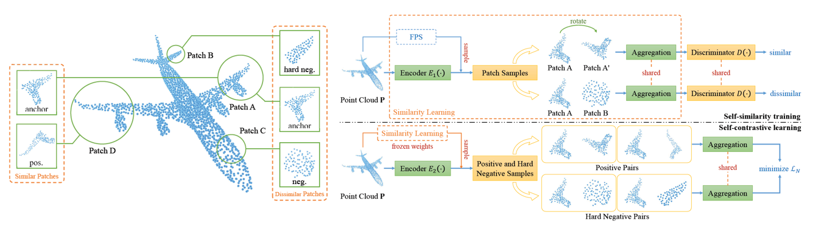

# SCL：Self-Contrastive Learning with Hard Negative Sampling for Self-supervised Point Cloud Learning


[[Paper]](https://arxiv.org/abs/2107.01886) [[Code]](https://github.com/pkudba/SCL) 

This repository is the official PyTorch implementation of the following paper: 

Bi’an Du, Xiang Gao, Wei Hu, Xin Li, "Self-Contrastive Learning with Hard Negative Sampling for Self-supervised Point Cloud Learning," accepted to *ACM International Conference on Multimedia (ACM MM), July, 2021.*

## Requirements

#### Recommended Environment

The code has been tested with the following environment:

- Python3==3.8.11
- pytorch==1.7.1
- scikit-learn==0.23.2
- torch-geometric==1.6.1
- pytorch3d==0.5.0
- h5py==2.10.0

#### Install via Conda

We provide a yaml file that allows instantaneous environment setup. Run the following command and it will create a conda environment named `SCL` with all required packages installed:

```powershell
conda env create -f environment.yml
conda activate SCL
```

#### Install Manually

You may also set up the environment manually. We provide the instruction as follows:

```python
# Create a conda environment
conda create --name SCL python=3.8
conda activate SCL
# install required packages
conda install -c pytorch pytorch=1.7.1 torchvision cudatoolkit=10.2
conda install -c fvcore -c iopath -c conda-forge fvcore iopath
conda install -c bottler nvidiacub
conda install pytorch3d -c pytorch3d
conda install -y scikit-learn=0.23.2
conda install -y -c conda-forge h5py=2.10.0 
conda install -c conda-forge tensorboardx
# Install PyTorch Geometric
pip install torch-cluster==1.5.8 -f https://pytorch-geometric.com/whl/torch-1.7.1+cu102.html
pip install torch-sparse==0.6.8 -f https://pytorch-geometric.com/whl/torch-1.7.1+cu102.html
pip install torch-scatter==2.0.5 -f https://pytorch-geometric.com/whl/torch-1.7.1+cu102.html
pip install torch-geometric==1.6.1
```

## Dataset

To evaluate the model, `ModelNet40` and `ShapeNet Part` dataset in HDF5 format are required to be downloaded and unzipped to the `data` folder.

Download `ModelNet40` dataset for classification task by running the following commands:

```
cd ./data
wget https://shapenet.cs.stanford.edu/media/modelnet40_ply_hdf5_2048.zip
unzip modelnet40_ply_hdf5_2048.zip
rm modelnet40_ply_hdf5_2048.zip
```

Download `ShapeNet Part` dataset for segmentation task by running the following commands:

```
cd ./data
wget https://shapenet.cs.stanford.edu/media/shapenet_part_seg_hdf5_data.zip
unzip shapenet_part_seg_hdf5_data.zip
rm shapenet_part_seg_hdf5_data.zip
mv hdf5_data shapenet_part
```

The estimated normal vectors of `ShapeNet Part`  can be downloaded from [GoogleDrive](https://drive.google.com/drive/folders/18pQrOx9GwiC2WXe5s-9OI_zozAmSdDsr?usp=sharing), and manually place the `train_npynorm_of_ShapeNet` and `test_npyFile_of_ShapeNet` folders into `your-data-path` folder.

## Usage

You can run the following command to reproduce the results in our paper: We take the four main segmentation tasks as an example to introduce how to use our code, and the others are similar.

### Testing Pre-trained Models

Test Part segmentation result on ShapeNet Part dataset:

```python
python execute.py --mode segmentation --detail 4fc-seg --use-cuda True --device [your-cuda-device] --data-path [your-data-path] --eval-classifier True
```

Test Part segmentation result under 1-fc classifier setting:

```python
python execute.py --mode segmentation --detail 1fc-seg --use-cuda True --device [your-cuda-device] --data-path [your-data-path] --eval-classifier True
```

Test Semi-supervised Part segmentation result:

```python
python execute.py --mode segmentation --detail semi-seg --use-cuda True --device [your-cuda-device] --data-path [your-data-path] --eval-classifier True
```

Test Semi-supervised Part segmentation result with fine-tuning:

```python
python execute.py --mode segmentation --detail semi-ft --use-cuda True --device [your-cuda-device] --data-path [your-data-path] --eval-classifier True
```

You should specify the `[your-cuda-device]` (e.g., `[0,1,2,3]`), and the `[your-data-path]`. For instance:

```python
python execute.py --mode segmentation --detail 4fc-seg --use-cuda True --device 0 1 2 3 --data-path ./data --eval-classifier True
```

You can also appoint `--use-cuda false` to use CPUs for evaluation.

### Training

To train the feature extractors in an unsupervised fashion, run

```python
python execute.py --mode train-siamese --use-cuda True --device 0 1 2 3
```

```python
python execute.py --mode train --use-cuda True --device 0 1 2 3
```

After training the feature extractors, you can train the classifier by running the following command:

```
python execute.py --mode segmentation --detail 4fc-seg --use-cuda True --eval-classifier False --backbone-path [your-backbone-path]
```

Again, you should specify the `[your-backbone-path]`.  

## Citation

Please cite our paper if you use any part of the code from this repository:

```
@inproceedings{du2021self,
  title={Self-Contrastive Learning with Hard Negative Sampling for Self-supervised Point Cloud Learning},
  author={Du, Bi'an and Gao, Xiang and Hu, Wei and Li, Xin},
  booktitle={Proceedings of the 29th ACM International Conference on Multimedia},
  pages={3133--3142},
  year={2021}
}
```


